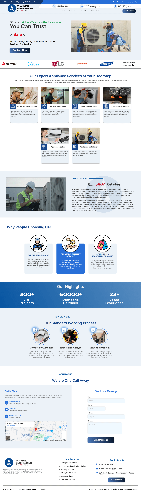
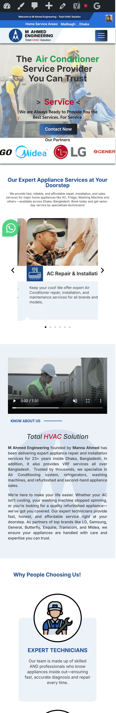

# 🌐 M Ahmed Engineering – WordPress Elementor Website

A responsive and SEO-optimized service website developed using **WordPress** and **Elementor Page Buiilder**, designed through **Figma** for M Ahmed Engineering, an appliance servicing business in Bangladesh.

## 📌 Project Highlights

- 🔧 Built with **WordPress + Elementor Page Builder**
- 🎨 Fully customized Design using **Figma**
- 📱 Mobile responsive design
- 🚀 Fast loading & SEO-ready (Yoast SEO)
- 🧰 Integrated service booking/contact forms
- 🌍 Live site: [Visit Website](https://mahmedengineering.com)

## 📷 Screenshots

<table>
  <tr>
    <td align="center" valign="top">
      <strong>🖥️ Desktop View</strong> 
      
    </td>
    <td align="center" valign="top">
      <strong>💻 Tablet View</strong> 
      
    </td>
    <td align="center" valign="top">
      <strong>📱 Mobile View</strong> 
      
    </td>
  </tr>
</table>

## 🧩 Elementor Customizations

- Built with **Elementor Free** (no Pro required) and **Custom CSS**
- Custom headers & footers via Free Plugin
- Motion effects, hover animations, and Sticky Header
- Section-based layout for fast editing and reuse

## ⚙️ Tech Stack

- WordPress 6.x
- Elementor Page Builder
- Custom CSS & JavaScript
- Responsive Design (Media Queries)
- Yoast SEO Plugin

## ✍️ Author

<table>
  <tr>
    <td align="center" valign="top" width="50%">
      <strong>👨‍💻 Asiful Pranto</strong> 
      Frontend & WordPress Developer 
      [Website](https://asifulpranto.com) 
      [LinkedIn](https://linkedin.com/in/asiful-i-pranto) 
    </td>
    <td align="center" valign="top" width="50%">
      <strong>👨‍💻 Imam Hossain Rafat</strong> 
      Frontend Web Developer 
      [Website](https://coauthorwebsite.com) 
      [LinkedIn](https://linkedin.com/in/coauthorprofile) 
    </td>
  </tr>
</table>

## 📃 License

This project is Designed and Developed for our client M Ahmed Engineering Business purposes. All Rights reserved by M Ahmed Engineering. Please do not use the exact design commercially without permission.

